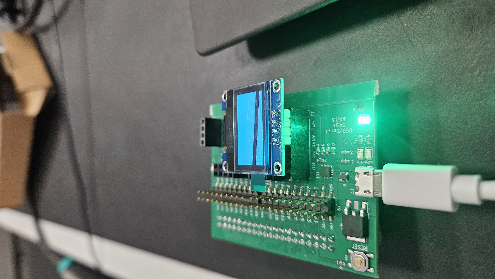
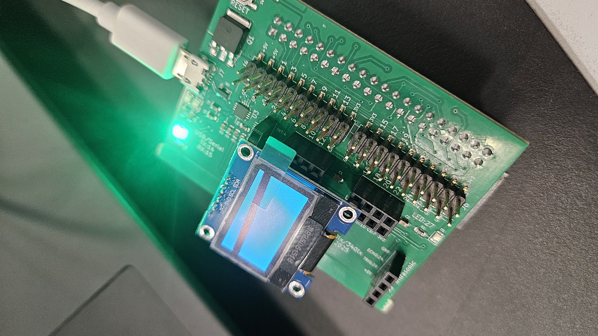

### Oled displays  (Irene Geng)

<p float="center">
  
  
</p>

Irene (340lx'25) likes displays so much she made two different labs!
  - [ssd1306-display](./ssd1306-display): these are in the 
    smaller rounded corner boxes.
  - [sh1106-display](./sh1106-display/): these are in the larger
    rectangular boxes.

These tiny displays are ubuitious and extremely similar, so it's probably
worth doing both!


### Post-script (Dawson)

Easy way to tell which you have:
  - Hook up the wires into the Parthiv board in the same header as you used
    for the 6050 MPU using M-to-F jumpers:
     - 3v3 
     - Gnd
     - GPIO 2 for SDA
     - GPIO 3 for SCL.
  - Try running the staff binaries: 
      - `sh1106-0-fill-screen.bin`
      - `ssd1306-0-fill-screen.bin`
  - You will hopefully see a square for one of them.
  - If not: Make sure you power cycle after each attempt;

### Checkoff

Pretty simple checkoff:
  1. Draw a moving vertical line
  2. Draw a moving horizontal line
  3. Do something cute!  Bouncing ball, smiley face that opens and
     closes mouth, spinning wire frame.  Note: This probably will
     superceded(1) and (2).


### Overview

Would recommend starting with the SSD1306, as the datasheet
for the SSD1306 is more well-written.

The SH1106 has a couple quirks in comparison:
- Although the display claims to have 132x64 bits of SRAM, it only has 128x64 visible pixels. This might affect your indexing scheme when writing to the display buffer, as pixel (2,0) in SRAM corresponds to pixel (0,0) on the display.
- SH1106 only supports page-addressing mode, which is less convenient if you prefer to update the entire screen on each frame.

If you bit-bang your i2c you can do many of them at once.  A great
extension is having 6 or more making a larger paned display with
interesting animations (e.g., a box rotating and flying between them
tends to get attention :).

### Supplemental datasheets

Given how confusing the original datastheet is, as an experiment over
winter break I was experimenting with making quick start datasheets
that in theory were better (cross referencing across multiple LLMs).
For what its worth, two of them:
  - [docs/SSD1306-supplemental-1.md](docs/SSD1306-supplemental-1.md)
  - [docs/SSD1306-supplemental-2.md](docs/SSD1306-supplemental-2.md)

They seemed better at explaining concepts and quick start, but haven't
been heavily tested.  The suggested blank does work:
```c
void notmain(void) {
    // Initialize I2C with some settling time
    delay_ms(100);
    i2c_init_clk_div(1500);
    delay_ms(100);

    // Step 2: Send minimal initialization (bare minimum)
    uint8_t init[] = {
        0x00,        // Control byte: command stream
        0xAE,        // Display OFF
        0x8D, 0x14,  // Enable charge pump (CRITICAL!)
        0xAF,        // Display ON
        0xA5         // Ignore RAM, all pixels ON (test mode)
    };
    i2c_write(0x3C, init, sizeof(init));
}
```
