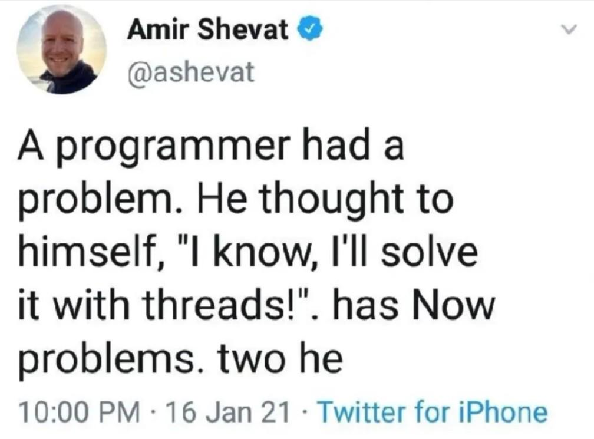

---

marp: true
theme: default
paginate: true
html: true

style: |
section ul,
section ol {
  line-height: 1.2;
  margin-top: 0.1em;
  margin-bottom: 0.1em;
}
section li + li {
    margin-top: 0.1em;
}

---



# Eraser notes (240lx spr26)
---
## Eraser: Savage, Burrows et al.

Famous.
 - Only one of 3 non-performance SOSP papers in the 90s.
 - Catches race conditions by looking for inconsistent locks.
 - Uses dynamic binary translation (ATOM) to check a "consistent"
   lock is held for each load/store of memory word.

Problem:
 - DBT = 1MLOC system (ATOM).  
 - Notable if can run in kernel.  

Today:
 - use your mem trap to make Eraser in a < 300 lines.


---
## Basic Eraser idea: lockset
<div style="display: flex;">
<div style="flex: 1;">

Intuition:
 - th.lockset: the locks a thread holds now.
 - mem.lockset: the intersection of locks held 
   when mem accessed in past.

</div>
<div style="flex: 1;">

Transition table:
 - initial:     th.lockset = {}
 - initial:     mem.lockset = {all}
 - lock(l1):    th.lockset U= {l1}
 - unlock(l1):  th.lockset -= {l1}
 - load [mem], or store [mem]: 
    - mem.lockset = th.lockset \inter mem.lockset
    - if mem.lockset = {} error
 - free(mem):   mem.lockset = {}


</div>
</div>


---
## Basic Eraser idea: lockset

  <style scoped>
  p, li { font-size: 23px; }
  </style>


Intuition:
 - th.lockset: the locks a thread holds now.
 - mem.lockset: the intersection of locks held 
   when mem accessed in past.

Transition table:
 - th=fork(...): th.lockset = {}
 - mem=malloc(): mem.lockset = {all}
 - lock(l1):     th.lockset U= {l1}
 - unlock(l1):   th.lockset -= {l1}
 - load [mem], or store [mem]: 
    - mem.lockset = th.lockset \inter mem.lockset
    - if mem.lockset = {} error

---
## Example

  <style scoped>
  p, li { font-size: 23px; }
  </style>


```
     x.lockset={all}
     T1.lockset = {}
-----------------------------------
    T1         |
   lock(L1)    |   T1.lockset = {L1}
   x++;        |   x.lockset = {L1}
   unlock(L1)  |   T1.lockset = {}
        <switchto T2>
    T2
   lock(L2)    |   T2.lockset = {L2}
   x++;        |   x.lockset = {}
                   error "empty lockset for x!"
```
Key:
 - order of set intersection doesn't matter.
 - so find error no matter what order we run T1,T2!

---
## Hack 1: initialize mem without locks.

  <style scoped>
  p, li { font-size: 25px; }
  </style>

Common pattern:
  - initialize mem without holding mem's lock.
  - This is fine b/c mem not reachable yet.
  - Not reachable = no concurrent access possible.
  - No lock needed.

We can't compute reachable(mem), so do a hack:
  - track which thread accesses mem first.
  - don't track its lockset. no errors.
  - when *another* thread T access mem, then 
     mem.lockset = T.lockset.
  - track it as usual.

---
## Hack 2: initialize mem, then read-only.

Common pattern:
  - initialize mem with stores.
  - release it.
  - all threads access read-only.
  - Don't need locks b/c no mutation.

Hack:
  - Do the initialization hack, but as long
    as accesses are loads, don't flag.
  - If there is a store: flag as normal.

---
## Today

- We give you a trivial eraser that only tracks one lock and one
  memory location.
- Make it track multiple of both (write some tests).
- Add the two hacks above
- Tons of extensions: doing shadow memory is great!

Note:
  - Very reasonable lab for Daniel mode.
  - You'll have to update the readme halfway through --- I'm 
    moving some tests around.
