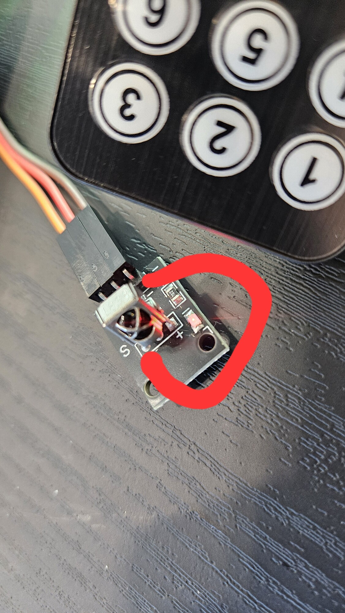

---

marp: true
theme: default
paginate: true
html: true                      

style: |
section ul,
section ol {
  line-height: 1.2;
  margin-top: 0.1em;
  margin-bottom: 0.1em;
}
section li + li {
    margin-top: 0.1em;
}


---


# IR notes (240lx spr26)
---



# IR notes (240lx spr26)


---
# Reverse engineering IR

Rough LX heuristic:
  - We'll do some grinding low level labs
  - Then often do a fun device lab b/c why-not.

Today's fun: IR reverse engineering.
  - LX theme: take something ubiqutous+opaque and pull it apart.
  - For me at least: more fun than sensible to figure out.
  - Practical: turn volume down on roommate TV (or turn off airport CNN TV
    on summer vac flight?)
  - Extension: use IR LED+receiver to make a network bootloader.

---
<!-- _style: "section { font-size: 0.85em; }" -->  
## Basic idea

 - IR receiver:
   1. Default reading 1 (nothing happening).
   2. To make read 0: Turn IR LED off/on at a fixed rate (38Khz for ours)
 - To transmit "0":
   1. IR = 0: 600 usec.   
   2. IR = 1: 600usec.
 - To transmit "1":
   1. Transmit (IR = 0): 600 usec.   
   2. No signal (IR = 1): 1600usec.
 - Could send other symbols too if you have your own transmit.
 - Why tristate? so don't receive a "0" (or "1") when out of range, not sending.

---
# DWEII Protocol

The approximate timings for the black DWEII remote I used (all times
in microseconds):

        Signal   |  signal, IR=0    |  no signal, IR=1
         HEADER  |    9000          |  4500
         0 bit   |     600          |  600
         1 bit   |     600          |  1600
         STOP    |     600          |   --


NOTE: you should check these!  
  - I bought the cheapest versions I could find.
  - If 53 sets work identically I'll be shocked.

---
## Simple Example.

- Push "OK" button and dump all the times it read 0.  Recall:
   - no reading: gpio_read(pin)=1
   - reading   : gpio_read(pin)=0

```
0: pin21=0: usec=9108 pin21=1, usec=4489    # header
2: pin21=0: usec=616 pin21=1, usec=527      # 0
4: pin21=0: usec=610 pin21=1, usec=527      # 0
...
18: pin21=0: usec=613 pin21=1, usec=1658    # 1
20: pin21=0: usec=590 pin21=1, usec=1658    # 1
...
64: pin21=0: usec=614 pin21=1, usec=1633    # 1
66: pin21=0: usec=615 pin21=1, usec=40000   # done
```
---
## Some gotcha's (besides no-signal=1)

***Number one mistake***: Printing when bits could arrive
  - Universal mistake when receiver has finite buffers.
  - Cliche story: Your device doesn't work, so you print.  Makes it worse.
  - You saw this with Hardware UART in 140e: 
    - miniUART buffer = 8 bytes.
    - Print when receiving: if more bytes come in, you'll lose them (sometimes).
    - Problem is worse here b/c GPIO pin has no buffer at all.

***Second problem***: timings will fluctuate some from run to run.  
  - Easy hack: compute midpoint, pick whichever its closest to.
  - But: Probably should flag if way off b/c your code has some other issue.

---
# Quick-start

Hookup:
  1. Use jumpers to connect: "+" to 3v, "-" to ground, S to GPIO 21.
  2. Quick-check: push button, should see red on receiver.
  3. `cd code; make`.  Push button.  Should see times print out.

Reverse engineer:
  1. Figure out how long 0 transmitted for.
  2. Figure out how long 1 transmitted for.
  1. Convert the times to 0,1 and shift into a 32-bit integer. 
  2. Should be semi-stable from press to press for same key.
  3. Record the integer for each button.

Then do some kind of extension.  

---
# Come and get

<!-- Large image across the top -->


