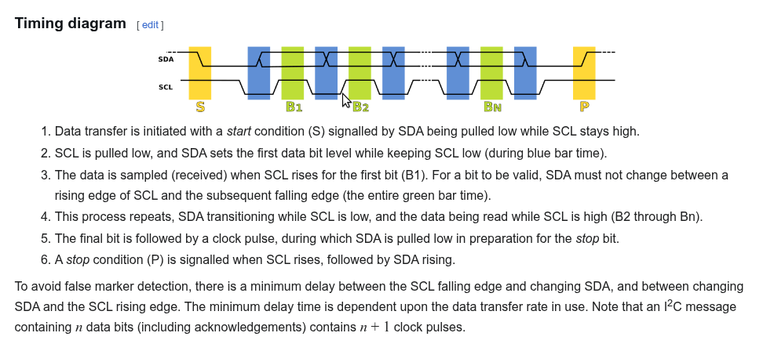
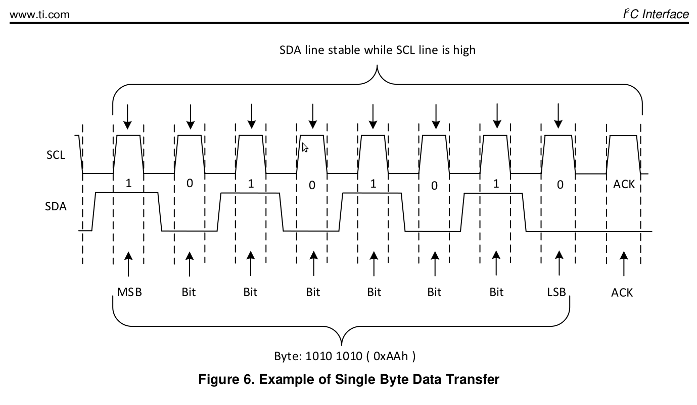
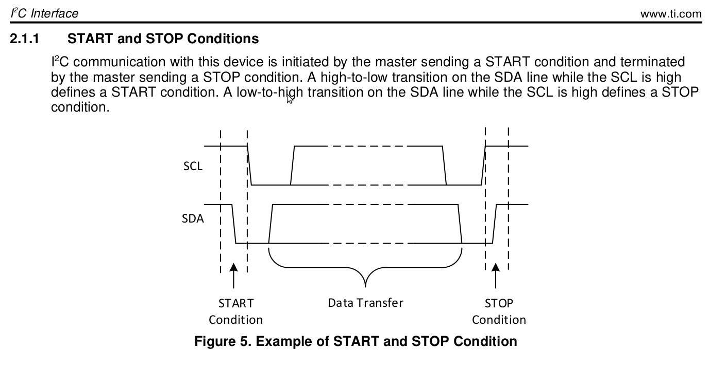
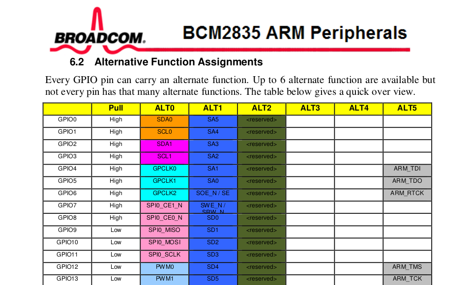

---

marp: true
theme: default
paginate: true
html: true

style: |
section ul,
section ol {
  line-height: 1.2;
  margin-top: 0.1em;
  margin-bottom: 0.1em;
}
section li + li {
    margin-top: 0.1em;
}

---


# I2C notes (240lx spr26)
---
## I2C

Medium complexity device with the usual patterns:
   - bunch of magic addresses, bunch of magic constants
   - passive definitional voice when you just want an example.
   - errata.
   - a couple hardware-is-not-software gotchas.
   - but, also: you can always bit bang it (and you have/will)

Solve the above, get the big prize: no more magic.
  - all code from IMU lab = yours.

---
## We already have UART: why another protocol?

| Property | UART | I2C |
|---|---|---|
| Speed | Pretty slow | Pretty slow |
| Wires | 2 wires: `tx`, `rx` | 2 wires: `SDA`, `SCL` |
| Topology | 1 sender / 1 receiver | Many slave devices |
| Addressing | Point-to-point | ~7-bit addresses |
| Timing | Tight timing: receiver must know when to sample after start bit | Loose timing: use `SCL` to know when `SDA` is valid |
| Duplex | Full duplex | Half duplex |
| Collision | No collision | Can detect collision by reading `SDA` after sending |


---
## Key difference: i2c use "open-drain" to "send" 1.

- UART writes 1 for 1, 0 for 0.
  - Easy. Obvious.  But not the only way to do this!
  - Unfortunately; doesn't work for I2C

- Problem: device(s) and master share data line (SDA)
  - If both device and master write 1 = short circuit.
  - "Just don't do that" is harder than it looks.
  - So instead it uses a pullup trick
---
## Open Drain: How two 1's don't cause a short circuit

- SDA has a permanent pullup resistor to 3.3V (always on)
- Each device's pin is EITHER:
  - Input: transistor off, pin is floating.
    Pullup wins =  line reads as 1.
  - Output low: transistor on, pin connected to ground.
    Pullup loses (can't overcome the transistor) = line reads as 0.
- **Devices NEVER drive the line high.** No one ever pushes 3.3V.
  Going high = releasing, letting pullup do it.

---
## Result: wired-AND behavior

- No one driving ==> pullup wins ==> reads as digital 1
- One or more devices pulling low ==> reads as digital 0
- Multiple devices can pull low simultaneously ==> no conflict.
- Collision detection: after releasing (to send 1), read line back.
  If it reads 0, someone else is pulling ==> collision.
- Not crucial, but interesting behavior: 
  - low device addresses "win" collisions.
  - collisions not destructive (one winner).
---
## Easiest way to see: use GPIO to do loopback send

---
## Standard loopback

```c
output("obvious standard loopback test\n");
gpio_set_output(out);
gpio_set_input(in);
for (int i = 0; i < N; i++) {
    gpio_write(out, 1);
    if (!gpio_read(in)) 
        panic("missing jumper from %d to %d\n", in,out);
    output("%d: 1\n", i);

    gpio_write(out, 0);
    if (gpio_read(in)) 
        panic("missing jumper from %d to %d\n", in,out);
    output("%d: 0\n", i);
}
```

---
## "Open drain" loopback

```c
output("pullup loopback test\n");
gpio_write(out,0);
gpio_set_pullup(out);  
for (int i = 0; i < N; i++) {
    // write 1
    gpio_set_input(out); // connects pin to pullup
    delay_us(1);         // chase why for fun :)
    if (!gpio_read(in)) 
        panic("missing jumper from %d to %d?\n", in,out);
    output("%d: 1 -> 1\n", i);

    // write 0
    gpio_set_output(out); // disconnect from pullup
    gpio_write(out, 0);   // ~instantaneous: no delay
    if (gpio_read(in))
        panic("missing jumper from %d to %d?\n", in,out);
    output("%d: 0 -> 0\n", i);
}
```


---
## i2c timing 

<!-- Large image across the top -->


---
## i2c data timing 

<!-- Large image across the top -->


---
## i2c start-stop timing 

<!-- Large image across the top -->


---
## Setting GPIO pins: i2c

<!-- Large image across the top -->


---
# standard i/o device Qs (echoes of UART)

  1. How to turn off?  (why?)
  2. How to configure?  (today: speed)
    - How to clear old data? (Why?)
    - What can we ignore?  (Everyone's favorite!)
    - How to sanity check?  (initial values, readback, xcheck)
    - What other devices do we need? (Speed \implies usually > 1)
  3. How to turn on?
  4. RX: Has data?  How to get?
  5. TX: Has space? How to send?

---
# Now: take a partner and find the page numbers

Algorithm:
 1. Go through each register in order (so don't miss).
 2. Get the page number, bit position
 3. Get ordering rules.

---
## Open Drain: How to make two 1's not = short circuit

- To send a 1:
  - SDA: use "pullup resistor" to connect SDA to 3.3v 
  - Reads as logical 1. 
  - So: by default, doing nothing = 1.  (no short circuit)

- To send a 0:
  1. Switch to output (disconnects pullup)
  2. Write 0.


- Result:
  - if no one uses it, reads digital 1.
  - if >= 1 using: SDA pulled low, reads as digital 0
  - collision: listen while use.  if 0 when you expect 1: collision.

