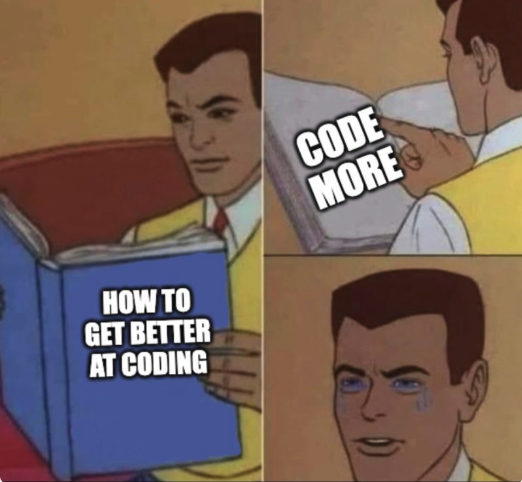

## 240lx Labs.

Overview:
  - We generally alternate between a couple technical labs and then
    something fun.  Often if there is a hard topic we will do a lab on it,
    wait a couple weeks and then do another so that it can sink in more
    ("spaced repetition").
  - The first part of the class usually spends a bit more time per lab
    since there are people that haven't taken 140e.  The latter portion
    of the class speeds up.

Labs:
   - [0-pi-setup](0-pi-setup/): pi setup.
   - [1-dynamic-code-gen](1-dynamic-code-gen/): how 
     to generate executable machine code at runtime and how to 
     use this trick to do neat stuff.  
   - [2-jit-derive](2-jit-derive): reverse engineer machine code encodings
     using the assembler.
   - [3-ir](3-ir): simple IR remote control reverse engineering.
   - [4-malloc+gc](4-malloc+gc): build a Boehm style garbage collector.
   - [5-debug-alloc](5-debug-alloc): build a simple debugging allocator.
     We use this for our later checking tools.
   - [6-pcb-lab](6-pcb): Parthiv Krishna (made the "Parthiv Board" we've
     been using for years as a 240lx final project, now at NVIDIA) is
     doing his widely-aclaimed pcb lab.  Very useful for final projects!

Possible labs, many more TBA (note: these aren't checked in yet):
   - [7-imu-i2c](7-imu-i2c): another fun device lab. Write the driver
     for an MPU-6050 accelerometer and gyroscope from the data sheet.
   - [8-i2c](8-i2c): write an I2C driver.  Now all the code for the 
     for the previous MPU lab is yours!
   - [9-profiler](9-profiler): use single-step debug hardware to build
     an exact instruction profiler.  Extend it with sleazy tricks
     to do cycle counting.
   - [10-pmu](10-pmu): use the arm performance counters to figure
     out interesting things.
   - [11-memcheck-trap](11-memcheck-trap): use domain protection and 
     debugging hardware to automatically trap every memory access.
   - [12-memcheck-trap-II](12-memcheck-trap-II): use the memory tracer
     you built and your debug allocator to make a simple purify-style 
     memory checker in a couple hundred lines of code.
   - [13-ws2812b](13-ws2812b): use the timing knowledge you gained from 
     the lab 10 (PMU) to write a addressable light array driver.
   - [14-stepper-motor](14-stepper-motor):  write a driver for
     the A4988 board and use it to drive a nema 17 stepper motor.  You
     can use this to build stuff all the way from robots to music.

Since spring quarter is rough, we'll provide some extra optional labs
that people can do instead of a final project.

   - [opt-keyboard-4x4](dev-keyboard-4x4): quick lab for a standard 4x4 
     (16 button) matrix keyboard.  

  

