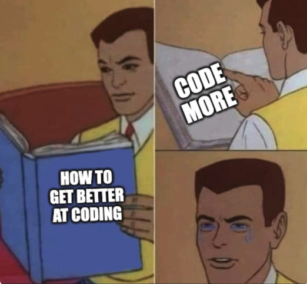

## 240lx Labs.

Overview:
  - We generally alternate between a couple technical labs and then
    something fun.  Often if there is a hard topic we will do a lab on it,
    wait a couple weeks and then do another so that it can sink in more
    ("spaced repetition").
  - The first part of the class usually spends a bit more time per lab
    since there are people that haven't taken 140e.  The latter portion
    of the class speeds up.

NOTE: 
  - This year since everyone is pretty blasted from 140E we're starting
    with more device labs than usual b/c they are (1) fun, (2) not too
    bad for tricky concepts and (3) useful for final projects

Labs:
   - [0-pi-setup](0-pi-setup/): pi setup.
   - [1-dynamic-code-gen](1-dynamic-code-gen/): how 
     to generate executable machine code at runtime and how to 
     use this trick to do neat stuff.  
   - [2-jit-derive](2-jit-derive): reverse engineer machine code encodings
     using the assembler.
   - [3-ir](3-ir): simple IR remote control reverse engineering.
   - [4-malloc+gc](4-malloc+gc): build a Boehm style garbage collector.
   - [5-debug-alloc](5-debug-alloc): build a simple debugging allocator.
     We use this for our later checking tools.
   - [6-pcb-lab](6-pcb): Parthiv Krishna (made the "Parthiv Board" we've
     been using for years as a 240lx final project, now at NVIDIA) is
     doing his widely-aclaimed pcb lab.  Very useful for final projects!
   - [7-imu-i2c](7-imu-i2c): another fun device lab. Write the driver
     for an MPU-6050 accelerometer and gyroscope from the data sheet.
   - [8-i2c](8-i2c): write an I2C driver.  Now all the code for the 
     for the previous MPU lab is yours!
   - [9-profiler](9-profiler): use single-step debug hardware to build
     an exact instruction profiler.  Extend it with sleazy tricks
     to do cycle counting.
   - [10-pmu](10-pmu): use the arm performance counters to figure
     out interesting things.
   - [11-ws2812b](11-ws2812b): use the timing knowledge you gained from 
     the lab 10 (PMU) to write a addressable light array driver.
   - [12-memtrace](12-memtrace): use domain protection and 
     debugging hardware to automatically trap every memory access.
   - [13-memcheck](13-memcheck): use the memory tracer
     you built and your debug allocator to make a simple purify-style 
     memory checker in a couple hundred lines of code.
   - [14-stepper-motor](14-stepper-motor):  write a driver for
     the A4988 board and use it to drive a nema 17 stepper motor.  You
     can use this to build stuff all the way from robots to music.
   - [15-oled-display](15-oled-display/):  we do Irene Geng's oled lab
     that she made for 340lx'25.  Cheap, ubiquitous, useful.  Fun, too!
   - [16-eraser-trap](16-eraser-trap/): Eraser is a famous race
     detection tool that uses binary-rewriting to instrumenting every
     load and store and flagging if a thread accessed the memory with
     inconsistent set of locks (its *lockset*).  Doing binary rewriting
     is hard.  By using debugging hardware and fast traps we can build
     a version in a few hundred lines of code: simply trap on every load
     and store and implement the lockset algorithm.

  

